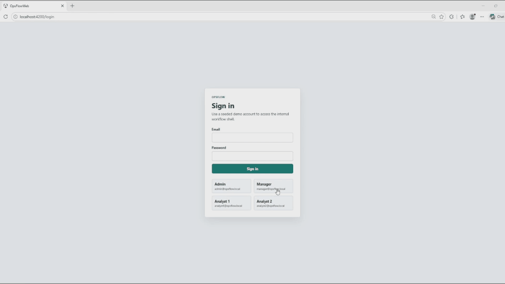
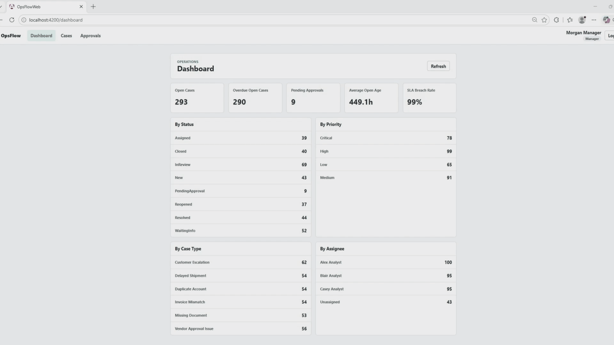
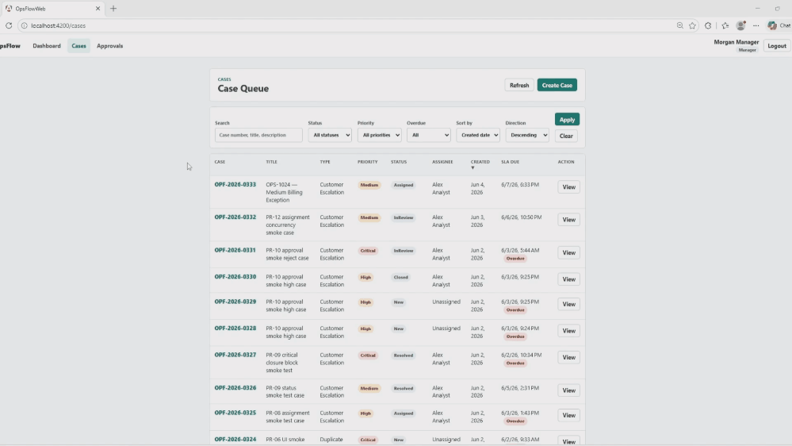
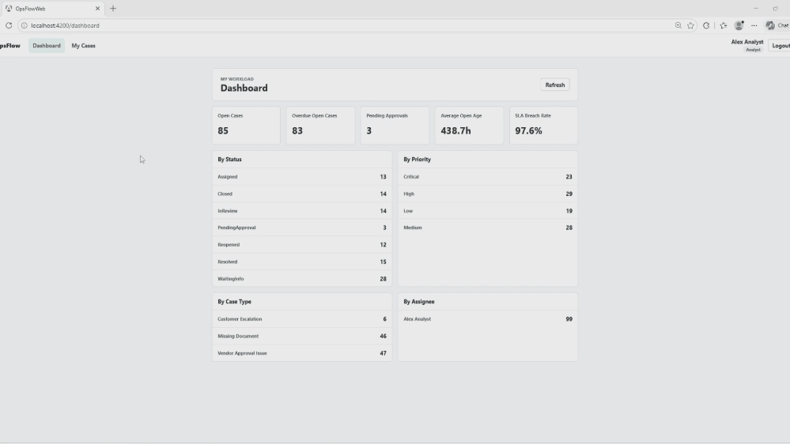

# OpsFlow

OpsFlow is a full-stack internal operations workflow system for managing cases, SLA risk, analyst assignments, role-based approval controls, business audit timelines, and SQL/EF-backed operational metrics. The API is the enforcement point for workflow transitions, object-level authorization, SLA calculation, approval gating, RowVersion concurrency checks, and consistent error responses.

Tech stack: ASP.NET Core Web API (.NET 10), Angular 21, SQL Server 2022, EF Core, ASP.NET Core Identity/JWT, xUnit, Docker Compose, GitHub Actions.

## Demo Preview



[Watch Full Demo Video in v1.0-demo Release](https://github.com/sanghunmok-prog/opsflow/releases/tag/v1.0-demo)

End-to-end Manager workflow: dashboard metrics, approval queue, case detail, approval decision, and dashboard refresh.

## What OpsFlow Demonstrates

- Role-based access with exactly three roles: `Analyst`, `Manager`, and `Admin`.
- Object-level authorization that scopes Analysts to assigned cases.
- Server-side queue filtering, pagination, sorting, search, and route query preservation.
- SLA due dates and query-time overdue calculation.
- Assignment, status transition, and High/Critical closure approval workflow.
- Business audit timeline for case lifecycle events.
- SQL/EF-backed operational dashboard metrics with drill-down links.
- Backend xUnit coverage and Angular build/test coverage.

## Backend Guarantees

- Analysts cannot access or mutate cases outside their assignment scope.
- Manager/Admin-only actions are enforced by API policies.
- High/Critical resolved cases require approval before closure.
- `PendingApproval` is reserved for the approval workflow and cannot be set directly through the generic status endpoint.
- Workflow mutations validate `RowVersion` according to endpoint policy.
- Lifecycle actions write business audit timeline entries.
- Dashboard metrics are derived from SQL/EF queries, not stored summary tables.

## Workflow Highlights

### SQL-backed Dashboard -> Server-side Queue Drill-down



Dashboard metrics are calculated from SQL/EF-backed queries, and each breakdown links into the case queue with server-side filters, pagination, sorting, and role scope preserved.

### Case Detail: SLA, Notes, Assignment, and Status Workflow



Case detail connects SLA due dates, query-time overdue state, notes, reassignment, status transitions, RowVersion-backed actions, and business timeline events.

### High/Critical Closure Approval Gate



High and Critical cases cannot be closed through the normal status path. The API requires a closure request, Manager/Admin approval, status history, and audit timeline updates before the case reaches `Closed`.

## SLA Model

SLA rules are stored in SQL in `SlaRules` and are selected by `CaseTypeId + Priority`. Seeded target hours are priority-based across every active case type: Low = 120, Medium = 72, High = 24, Critical = 8.

When a Manager/Admin creates a case, the API sets `DueAtUtc = CreatedAtUtc + TargetHours` from the active SLA rule. `IsOverdue` is not persisted. Queue, detail, approval queue, and dashboard reads derive overdue state at query time with:

```text
Status != Closed && nowUtc > DueAtUtc
```

The same interpretation applies to `WaitingInfo`, `Resolved`, `PendingApproval`, and `Reopened` cases until the case is closed.

## Approval Workflow

Low/Medium resolved cases can close through the normal status workflow. High/Critical resolved cases cannot be closed through `PATCH /api/cases/{caseId}/status`; the API rejects that transition and requires a closure request.

A closure request moves the case from `Resolved` to `PendingApproval`, creates an `ApprovalRequest`, writes `StatusHistory`, and records `ClosureRequested` in the audit timeline. Manager/Admin approval moves the case to `Closed` and sets `ClosedAtUtc`; rejection returns the case to `InReview`. Both decisions write status history and audit events.

## Architecture

OpsFlow uses a single Angular frontend, a single ASP.NET Core Web API, EF Core, SQL Server, and ASP.NET Core Identity/JWT. Business logic is implemented in application/infrastructure services behind controller endpoints.

```text
src/OpsFlow.Api             HTTP endpoints, auth, policies, startup
src/OpsFlow.Application     DTOs, service contracts, business exceptions
src/OpsFlow.Domain          entities, enums, role constants
src/OpsFlow.Infrastructure  EF Core, SQL Server persistence, Identity, seed data
src/OpsFlow.Web             Angular UI
tests/OpsFlow.Api.Tests     API, workflow, data, dashboard, auth tests
```

More detail:

- [Architecture](docs/architecture.md)
- [Workflow](docs/workflow.md)
- [ERD](docs/erd.md)
- [Data Model](docs/data-model.md)
- [API Map](docs/api-map.md)
- [API Contract](docs/api-contract.md)

## Local Quick Start

Run commands from the repository root.

1. Start SQL Server:

   ```bash
   docker compose up -d
   ```

2. Run the API:

   ```bash
   dotnet run --project src/OpsFlow.Api/OpsFlow.Api.csproj --urls http://localhost:5080
   ```

3. Confirm health:

   ```bash
   curl http://localhost:5080/health
   ```

4. Run Angular:

   ```bash
   cd src/OpsFlow.Web
   npm ci
   npm start
   ```

5. Open `http://localhost:4200`.

Seeded accounts use password `Password123!`.

| Role | Email |
| --- | --- |
| Admin | `admin@opsflow.local` |
| Manager | `manager@opsflow.local` |
| Analyst | `analyst1@opsflow.local` |
| Analyst | `analyst2@opsflow.local` |
| Analyst | `analyst3@opsflow.local` |

Full runbook: [Local Run](docs/local-run.md). Validation path: [Manual Smoke Checklist](docs/manual-smoke-checklist.md).

## Validation Commands

```bash
dotnet restore OpsFlow.sln
dotnet build OpsFlow.sln --no-restore
dotnet test OpsFlow.sln --no-build
```

```bash
cd src/OpsFlow.Web
npm ci
npm run build
npm test -- --watch=false
```

## Quick Links

- [Watch Full Demo Video in v1.0-demo Release](https://github.com/sanghunmok-prog/opsflow/releases/tag/v1.0-demo)
- [Demo Script](docs/demo-script.md)
- [GIF Capture Guidance](docs/assets/gifs/README.md)
- [Local Run](docs/local-run.md)
- [Manual Smoke Checklist](docs/manual-smoke-checklist.md)
- [API Contract](docs/api-contract.md)

## Scope Boundaries

OpsFlow intentionally focuses on a single internal workflow application: case intake, SLA risk, assignment, status workflow, High/Critical approval control, audit timeline, SQL-backed metrics, and reproducible local validation. It does not include distributed services, background escalation processing, exports, notifications, real-time messaging, payment flows, healthcare data, or large administrative configuration screens.
