# Architecture

OpsFlow is a single full-stack application with an Angular frontend, an ASP.NET Core Web API, EF Core, SQL Server, and ASP.NET Core Identity/JWT. The API owns authentication, authorization, workflow enforcement, SLA calculation, audit writes, dashboard queries, and persistence consistency.

## System Diagram

```mermaid
flowchart TB
    subgraph UI["Angular UI"]
        Login["Login"]
        Dashboard["Dashboard"]
        Queue["Case Queue"]
        Detail["Case Detail"]
        Approvals["Approval Queue"]
    end

    subgraph API["ASP.NET Core Web API"]
        Auth["AuthController<br/>POST /api/auth/login<br/>GET /api/auth/me"]
        Cases["CasesController"]
        ApprovalCtl["ApprovalsController"]
        DashboardCtl["DashboardController"]
        Lookups["CaseTypesController<br/>UsersController"]
        Jwt["JWT validation"]
        Policies["Role policies"]
        ObjectAuth["Object-level case authorization"]
    end

    subgraph Services["Application / Service Layer"]
        CaseQuery["Case query service"]
        CaseCommand["Case creation service"]
        Assignment["Assignment service"]
        Status["Status workflow service"]
        Approval["Approval service"]
        Notes["Notes service"]
        Timeline["Timeline service"]
        DashboardSvc["Dashboard query service"]
        Sla["SLA service"]
    end

    subgraph Data["EF Core / SQL Server"]
        Identity["AspNetUsers<br/>AspNetRoles<br/>AspNetUserRoles"]
        CasesTable["Cases"]
        CaseTypes["CaseTypes"]
        SlaRules["SlaRules"]
        CaseNotes["CaseNotes"]
        StatusHistory["StatusHistories"]
        AssignmentHistory["AssignmentHistories"]
        ApprovalRequests["ApprovalRequests"]
        AuditLogs["AuditLogs"]
    end

    Login --> Auth
    Dashboard --> DashboardCtl
    Queue --> Cases
    Detail --> Cases
    Approvals --> ApprovalCtl

    Auth --> Identity
    Cases --> Jwt
    ApprovalCtl --> Jwt
    DashboardCtl --> Jwt
    Lookups --> Jwt
    Jwt --> Policies
    Policies --> ObjectAuth

    Cases --> CaseQuery
    Cases --> CaseCommand
    Cases --> Assignment
    Cases --> Status
    Cases --> Approval
    Cases --> Notes
    Cases --> Timeline
    ApprovalCtl --> Approval
    DashboardCtl --> DashboardSvc
    Lookups --> CaseTypes
    Lookups --> Identity

    CaseCommand --> Sla
    Sla --> SlaRules
    CaseQuery --> CasesTable
    Assignment --> CasesTable
    Status --> CasesTable
    Approval --> CasesTable
    Notes --> CaseNotes
    Timeline --> AuditLogs
    DashboardSvc --> CasesTable
    DashboardSvc --> ApprovalRequests

    CasesTable --> CaseTypes
    CasesTable --> Identity
    CaseNotes --> CasesTable
    StatusHistory --> CasesTable
    AssignmentHistory --> CasesTable
    ApprovalRequests --> CasesTable
    AuditLogs -. logical timeline by EntityType + EntityId .-> CasesTable
```



## Authentication And Authorization

`POST /api/auth/login` is anonymous. It validates an active Identity user and password, then issues a JWT containing user and role claims.

Authenticated endpoints use JWT bearer validation. Controller policies enforce coarse role access, and services enforce object-level access:

- Analysts can query, read, note, and update status only for cases assigned to them.
- Managers/Admins can manage the global workflow, subject to status and approval rules.
- Notes and timeline reads use the same object-level access checks as case detail.
- Manager/Admin-only operations such as case creation, assignment, active analyst lookup, approval queue access, and approval decisions are enforced by API policies.

## Service Responsibilities

The service layer enforces the application rules behind the HTTP surface:

- Case creation validates input, calculates `DueAtUtc`, creates the case, and writes `CaseCreated`.
- The SLA service selects an active `SlaRule` by `CaseTypeId + Priority`.
- Case queries apply role-aware scope, filters, sorting, pagination, and query-time overdue calculation.
- Assignment validates the target Analyst, state, reason, optional `RowVersion`, assignment history, and audit event.
- Status transitions enforce the state matrix, direct `PendingApproval` blocking, High/Critical approval gating, required `RowVersion`, lifecycle timestamps, status history, and audit event.
- Closure requests validate role/object access, High/Critical `Resolved` state, duplicate pending approval prevention, required `RowVersion`, `ApprovalRequest`, status history, and audit event.
- Approval decisions validate Manager/Admin role, pending request state, related case state, optional supplied `RowVersion`, status history, lifecycle timestamps, and audit event.
- Notes validate object access and note body, then write `NoteAdded`.
- Timeline reads expose supported business audit events in chronological order.
- Dashboard queries calculate current metrics and breakdowns directly from SQL data.

## Transactional Consistency

Each workflow mutation is handled as one service operation and persisted through one EF Core `SaveChangesAsync` call. This keeps the case row and related history/audit rows consistent for the business operation.

Examples:

- Case creation writes `Cases` plus `AuditLogs` with the calculated `DueAtUtc`.
- Assignment writes the case assignee, `AssignmentHistories`, `Assigned` audit event, and, for `New` cases, `New -> Assigned` status history.
- High/Critical closure request updates the case to `PendingApproval`, creates an `ApprovalRequest`, writes `StatusHistories`, and writes `ClosureRequested`.
- Approval decision updates the `ApprovalRequest`, updates the case status, sets lifecycle timestamps as applicable, writes `StatusHistories`, and writes `ApprovalApproved` or `ApprovalRejected`.

## SLA Query Path

`DueAtUtc` is calculated when a case is created. The API does not persist `IsOverdue`. Queue, detail, approval queue, and dashboard reads derive overdue state from SQL data using:

```text
Status != Closed && nowUtc > DueAtUtc
```

Because the formula is query-time, `WaitingInfo`, `Resolved`, `PendingApproval`, and `Reopened` cases remain overdue when their `DueAtUtc` has passed. `Closed` cases are not treated as overdue.

## Persistence Boundary

SQL Server stores Identity users/roles, cases, case types, SLA rules, notes, assignment history, status history, approval requests, and audit logs. EF Core maps workflow enums as strings and configures `Cases.RowVersion` as an optimistic concurrency token.

OpsFlow uses a single Angular frontend, a single ASP.NET Core Web API, and one SQL Server database. It does not include microservices, Kubernetes, SignalR, background workers, outbox processing, or separate worker projects.
