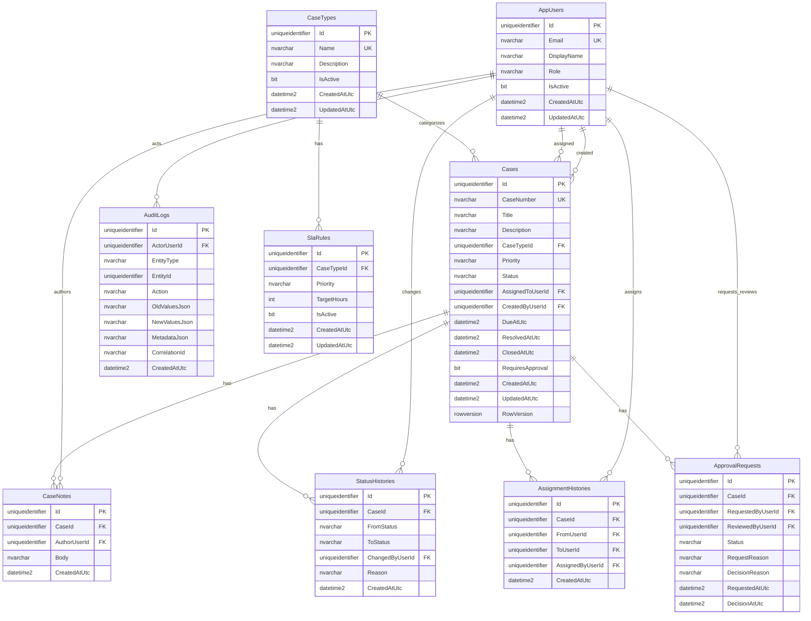

# Data Model

PR-01 introduces the SQL Server schema that will support future queue, detail, workflow, approval, audit, and dashboard features.

## Entity Summary

- `AppUsers`: demo user records and roles. Passwords and auth tables are intentionally not included in PR-01.
- `CaseTypes`: active business exception categories.
- `SlaRules`: active target hours by case type and priority.
- `Cases`: core exception records with due dates, assignment, lifecycle timestamps, approval requirement, and rowversion concurrency.
- `CaseNotes`: case-level notes.
- `StatusHistories`: workflow timeline entries.
- `AssignmentHistories`: assignment timeline entries.
- `ApprovalRequests`: pending/approved/rejected manager approval samples.
- `AuditLogs`: broad entity-level audit events.

## Mermaid ERD

## Important Constraints

- Enums are stored as strings for readable SQL.
- `Cases.CaseNumber`, `AppUsers.Email`, and `CaseTypes.Name` are unique.
- Active SLA rules are unique by `CaseTypeId` and `Priority`.
- Pending approvals are constrained to one pending request per case.
- History and audit relationships avoid cascade delete.
- `Cases.RowVersion` is configured for SQL Server optimistic concurrency.
