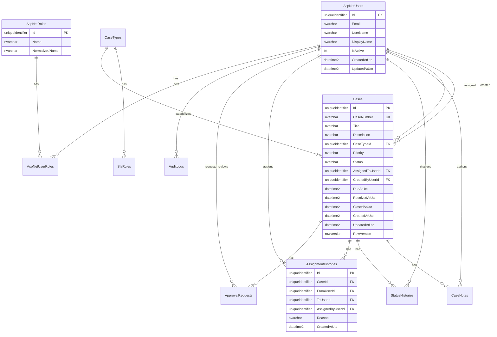

# Data Model

PR-01A aligns the SQL Server schema with the locked OpsFlow direction. It is a foundation schema only; authentication endpoints, case APIs, workflow actions, dashboard endpoints, and Angular business screens are later PR scope.

## Entity Summary

- `AspNetUsers`: ASP.NET Core Identity users with OpsFlow profile fields: `DisplayName`, `IsActive`, `CreatedAtUtc`, and `UpdatedAtUtc`.
- `AspNetRoles`: ASP.NET Core Identity roles. Seeded roles are exactly `Analyst`, `Manager`, and `Admin`.
- `AspNetUserRoles` and related Identity tables: Identity-compatible role membership, claims, logins, and tokens.
- `CaseTypes`: active business exception categories.
- `SlaRules`: active target hours by case type and priority. Locked targets are Low 120, Medium 72, High 24, and Critical 8 calendar hours.
- `Cases`: core exception records with due dates, assignment, lifecycle timestamps, status, and rowversion concurrency.
- `CaseNotes`: case-level notes.
- `StatusHistories`: workflow timeline entries.
- `AssignmentHistories`: assignment timeline entries with required business reason.
- `ApprovalRequests`: pending/approved/rejected manager approval samples.
- `AuditLogs`: business audit timeline entries.

## Workflow Fields

Case statuses are:

- New
- Assigned
- InReview
- WaitingInfo
- Resolved
- PendingApproval
- Closed
- Reopened

Audit actions are:

- CaseCreated
- NoteAdded
- Assigned
- StatusChanged
- ClosureRequested
- ApprovalApproved
- ApprovalRejected
- CaseReopened

Approval request statuses are:

- Pending
- Approved
- Rejected

## Mermaid ERD

## Important Constraints

- Enums are stored as strings for readable SQL.
- `Cases.CaseNumber`, `AspNetUsers.NormalizedUserName`, `AspNetRoles.NormalizedName`, and `CaseTypes.Name` are unique.
- Active SLA rules are unique by `CaseTypeId` and `Priority`.
- Pending approvals are constrained to one pending request per case.
- History and audit relationships avoid cascade delete.
- `Cases.RowVersion` is configured for SQL Server optimistic concurrency.
- `IsOverdue` is not persisted; it is calculated by query/DTO logic.
- Approval requirement is not stored on `Cases`; later workflow logic derives it from High/Critical priority and case state.
