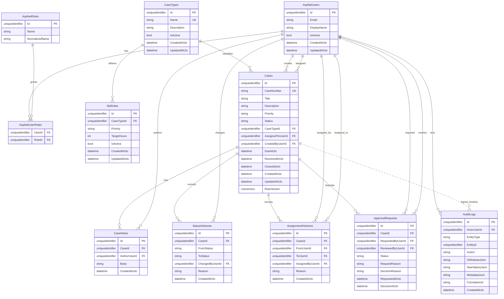

# Entity Relationship Diagram

This ERD shows the persistence model used by EF Core and SQL Server for OpsFlow workflow data. Identity tables are simplified to the user/role relationships relevant to authorization.

## Relationship Notes

`AuditLogs.EntityType + EntityId` is a logical case timeline relationship, not a database foreign key to `Cases`. The table remains generic, while the current timeline exposes supported case business events for `EntityType = "Case"`.

Nullable workflow fields:

- `Cases.AssignedToUserId` can be null for new unassigned cases.
- `Cases.ResolvedAtUtc` is null until a case reaches `Resolved`; it is retained after later approval or reopen operations.
- `Cases.ClosedAtUtc` is null until closure and is cleared when a case is reopened.
- `ApprovalRequests.ReviewedByUserId`, `DecisionReason`, and `DecisionAtUtc` are unset while approval is pending.
- `StatusHistories.FromStatus` is null for the initial seeded creation history.

## Constraints

- `Cases.CaseNumber` is unique.
- `CaseTypes.Name` is unique.
- Active SLA rules are unique by `CaseTypeId + Priority` using a filtered unique index.
- One pending approval per case is enforced by a filtered unique index on `ApprovalRequests.CaseId` where `Status = 'Pending'`.
- History and audit relationships use restricted or no-action delete behavior; case history is not cascade-deleted.
- `Cases.RowVersion` is configured as an EF Core concurrency token.
