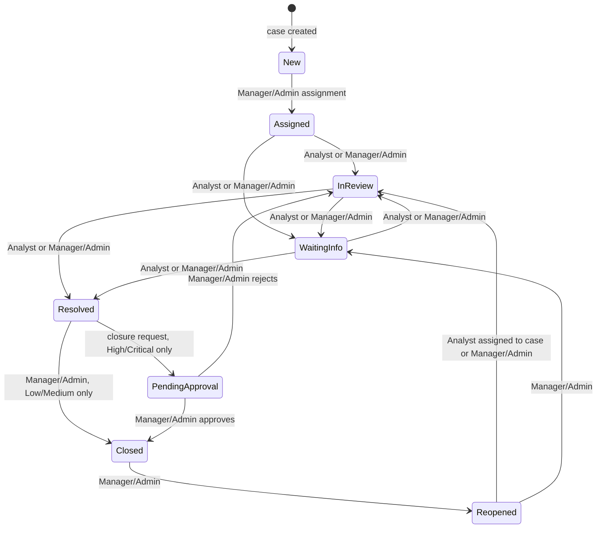

# Workflow

This document is the business workflow reference for case status changes, closure approval, authorization scope, concurrency behavior, and lifecycle side effects.

## State Diagram



## Transition Matrix

| From | To | Allowed roles | Key rule | Audit/history side effects |
| --- | --- | --- | --- | --- |
| `New` | `Assigned` | Manager/Admin | Assignment to active Analyst | `AssignmentHistory`, optional `StatusHistory`, `Assigned` |
| `Assigned` | `InReview` | Assigned Analyst, Manager/Admin | Requires `RowVersion` and reason | `StatusHistory`, `StatusChanged` |
| `Assigned` | `WaitingInfo` | Assigned Analyst, Manager/Admin | Requires `RowVersion` and reason | `StatusHistory`, `StatusChanged` |
| `InReview` | `WaitingInfo` | Assigned Analyst, Manager/Admin | Requires `RowVersion` and reason | `StatusHistory`, `StatusChanged` |
| `InReview` | `Resolved` | Assigned Analyst, Manager/Admin | Sets `ResolvedAtUtc` if unset | `StatusHistory`, `StatusChanged` |
| `WaitingInfo` | `InReview` | Assigned Analyst, Manager/Admin | Requires `RowVersion` and reason | `StatusHistory`, `StatusChanged` |
| `WaitingInfo` | `Resolved` | Assigned Analyst, Manager/Admin | Sets `ResolvedAtUtc` if unset | `StatusHistory`, `StatusChanged` |
| `Resolved` | `Closed` | Manager/Admin | Low/Medium only through normal status endpoint | `StatusHistory`, `StatusChanged`, `ClosedAtUtc` |
| `Resolved` | `PendingApproval` | Assigned Analyst, Manager/Admin | High/Critical closure request only | `ApprovalRequest`, `StatusHistory`, `ClosureRequested` |
| `PendingApproval` | `Closed` | Manager/Admin | Approve pending request | `ApprovalRequest`, `StatusHistory`, `ApprovalApproved`, `ClosedAtUtc` |
| `PendingApproval` | `InReview` | Manager/Admin | Reject pending request | `ApprovalRequest`, `StatusHistory`, `ApprovalRejected` |
| `Closed` | `Reopened` | Manager/Admin | Normal status endpoint | `StatusHistory`, `CaseReopened`, clears `ClosedAtUtc` |
| `Reopened` | `InReview` | Assigned Analyst, Manager/Admin | Analyst must be assigned | `StatusHistory`, `StatusChanged` |
| `Reopened` | `WaitingInfo` | Manager/Admin | Manager/Admin only | `StatusHistory`, `StatusChanged` |

## Approval Workflow Rules

`PendingApproval` is workflow-reserved. Direct status updates to `PendingApproval` are rejected by `PATCH /api/cases/{caseId}/status`.

Low/Medium `Resolved -> Closed` can use the normal status transition and is Manager/Admin-only. High/Critical `Resolved -> Closed` is rejected by the normal status endpoint and must use `POST /api/cases/{caseId}/closure-request`.

Approval approve moves `PendingApproval -> Closed`. Approval reject moves `PendingApproval -> InReview`. Both paths require a pending approval request and a related case currently in `PendingApproval`.

## Role And Object Authorization

Analysts can act only on assigned cases. Managers/Admins can act globally, subject to workflow rules. UI controls are convenience affordances; API validation is authoritative.

The same object-level case access rule applies to case detail, notes, timeline, assigned-case status updates, and Analyst closure requests.

## RowVersion And Concurrency

`Cases.RowVersion` is an EF Core optimistic concurrency token returned as a Base64 string on case detail, assignment responses, status responses, closure request responses, approval queue items, and approval decision responses.

Endpoint policy:

- `PATCH /api/cases/{caseId}/status` requires `rowVersion`; missing or invalid values return `400`, stale values return `409`.
- `POST /api/cases/{caseId}/closure-request` requires `rowVersion`; missing or invalid values return `400`, stale values return `409`.
- `PATCH /api/cases/{caseId}/assign` accepts optional `rowVersion`; invalid supplied values return `400`, stale supplied values return `409`.
- `POST /api/approvals/{approvalId}/approve` and `/reject` accept optional `rowVersion`; invalid supplied values return `400`, stale supplied values return `409`.

Approval decisions also enforce pending approval request state, related case `PendingApproval` state, and High/Critical priority, so an omitted approval-decision `rowVersion` does not bypass workflow invariants.

## Workflow Side Effects

- `StatusHistory` records status transitions with actor, reason, and timestamp.
- `AssignmentHistory` records previous assignee, new assignee, assigning user, reason, and timestamp.
- `ApprovalRequest` records closure request, pending/approved/rejected state, requester, reviewer, reasons, and decision timestamp.
- `AuditLog` records supported business timeline actions for case lifecycle events.
- `UpdatedAtUtc` changes on assignment, status transitions, closure requests, and approval decisions.

## Lifecycle Timestamp Rules

- `ResolvedAtUtc` is set when a status transition targets `Resolved` and remains unchanged if already set.
- `ClosedAtUtc` is set when a normal Low/Medium close succeeds or a High/Critical approval is approved.
- `ClosedAtUtc` is cleared when a closed case is reopened.
- Approval rejection returns the case to `InReview` and does not set `ClosedAtUtc`.
- `UpdatedAtUtc` is set to the current UTC time for workflow mutations.

`CaseDetailDto` currently returns `ClosedAtUtc` but not `ResolvedAtUtc`; `ResolvedAtUtc` is persisted in SQL and represented in the data model.

## SLA Across States

SLA overdue state is interpreted consistently across queue, detail, approval queue, and dashboard:

```text
Status != Closed && nowUtc > DueAtUtc
```

That means `WaitingInfo`, `Resolved`, `PendingApproval`, and `Reopened` cases remain overdue when past `DueAtUtc`. Closing the case removes it from open/overdue calculations.
